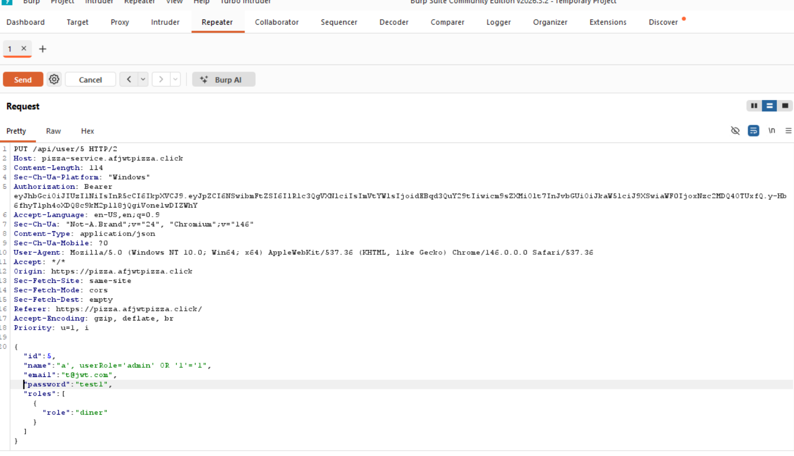
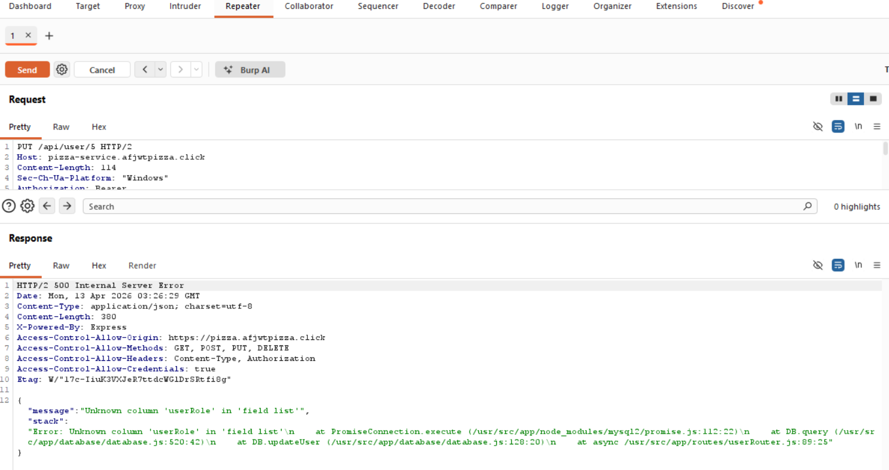
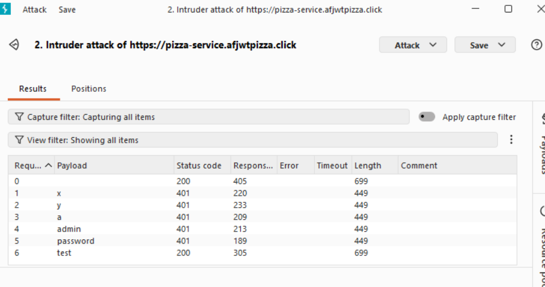
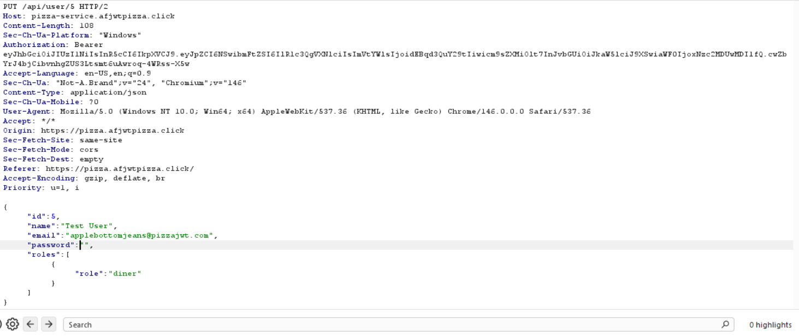
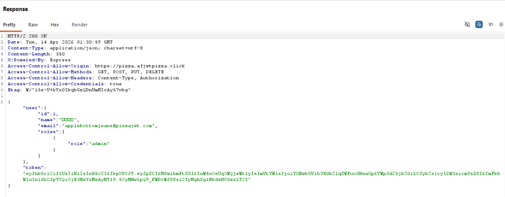
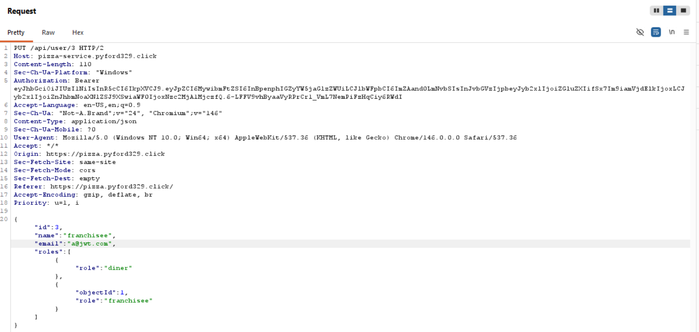
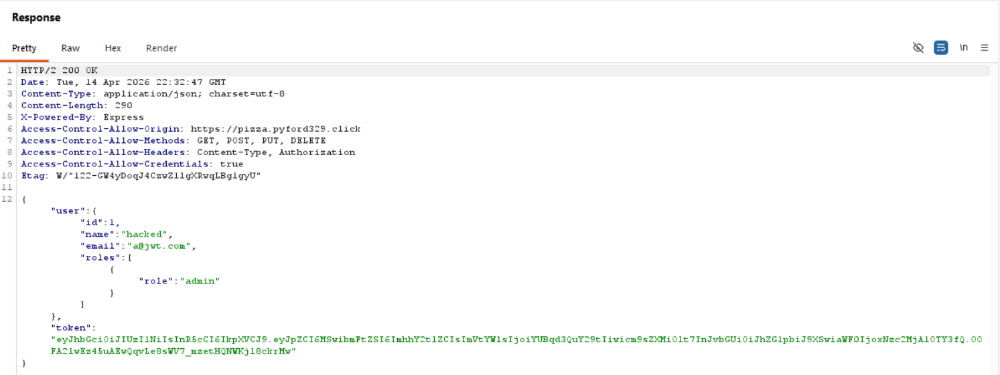
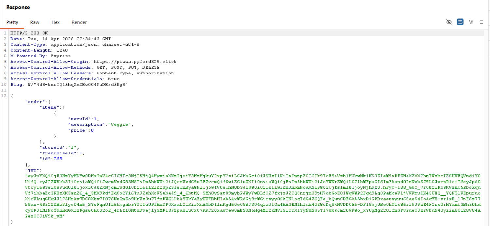

# Penetration Report

## Anna Egbert and Preston Ford

## Self Attack

### Anna

| Item           | Result                                                                             |
| -------------- | ---------------------------------------------------------------------------------- |
| Date           | April 13, 2026                                                                     |
| Target         | pizza.afjwtpizza.click                                                             |
| Classification | Injection                                                                          |
| Severity       | 1                                                                                  |
| Description    | SQL injection attempted, database accessed                                         |
| Images         |     |
| Corrections    | Sanitize user inputs                                                               |

| Item           | Result                                              |
| -------------- | --------------------------------------------------- |
| Date           | April 13, 2026                                      |
| Target         | pizza.afjwtpizza.click                              |
| Classification | Identification and Authentication Failures          |
| Severity       | 2                                                   |
| Description    | Attacker guessed user's simple password.            |
| Images         |    |
| Corrections    | Have better passwords, limited login attempts       |

| Item           | Result                                                                                                     |
| -------------- | ---------------------------------------------------------------------------------------------------------- |
| Date           | April 13, 2026                                                                                             |
| Target         | pizza.afjwtpizza.click                                                                                     |
| Classification | Insecure Design                                                                                            |
| Severity       | 1-2                                                                                                        |
| Description    | Pizza price manipulation from customer.                                                                    |
| Images         |    Pizza can be bought for any price, including nothing. |
| Corrections    | Change price to rely on database instead of client side                                                    |

| Item           | Result                                                                                                                                |
| -------------- | ------------------------------------------------------------------------------------------------------------------------------------- |
| Date           | April 13, 2026                                                                                                                        |
| Target         | pizza.afjwtpizza.click                                                                                                                |
| Classification | Identification and Authentication Failures                                                                                            |
| Severity       | 3                                                                                                                                     |
| Description    | Update user allowed active user to change their email to the same email as the admin. Admin access was obtained.                      |
| Images         |       Admin credentils obtained |
| Corrections    | Disallow duplicate emails, identify user based on id instead of name or email when updating user                                      |

| Item           | Result                                                                            |
| -------------- | --------------------------------------------------------------------------------- |
| Date           | April 13, 2026                                                                    |
| Target         | pizza.afjwtpizza.click                                                            |
| Classification | Identification and Authentication Failures                                        |
| Severity       | 1                                                                                 |
| Description    | Authtoken never expires after a login.                                            |
| Images         |     |
| Corrections    | Add authtoken expiration.                                                         |

### Preston

## Peer Attack

### Anna on Preston

| Item           | Result                                                 |
| -------------- | ------------------------------------------------------ |
| Date           | April 14, 2026                                         |
| Target         | pizza.pyford329.click                                  |
| Classification | Identification and Authentication Failures             |
| Severity       | 3                                                      |
| Description    | Attacker guessed admin's simple password.              |
| Images         |    |
| Corrections    | Have better passwords, limited login attempts          |

| Item           | Result                                                                              |
| -------------- | ----------------------------------------------------------------------------------- |
| Date           | April 14, 2026                                                                      |
| Target         | pizza.pyford329.click                                                               |
| Classification | Injection                                                                           |
| Severity       | 1                                                                                   |
| Description    | SQL injection attempted, database accessed, every user's name changed               |
| Images         |     |
| Corrections    | Sanitize user inputs                                                                |

| Item           | Result                                                                                                           |
| -------------- | ---------------------------------------------------------------------------------------------------------------- |
| Date           | April 14, 2026                                                                                                   |
| Target         | pizza.pyford329.click                                                                                            |
| Classification | Identification and Authentication Failures                                                                       |
| Severity       | 3                                                                                                                |
| Description    | Update user allowed active user to change their email to the same email as the admin. Admin access was obtained. |
| Images         |            |
| Corrections    | Disallow duplicate emails, identify user based on id instead of name or email when updating user                 |

| Item           | Result                                                                                         |
| -------------- | ---------------------------------------------------------------------------------------------- |
| Date           | April 14, 2026                                                                                 |
| Target         | pizza.pyford329.click                                                                          |
| Classification | Insecure Design                                                                                |
| Severity       | 1-2                                                                                            |
| Description    | Pizza price manipulation from customer.                                                        |
| Images         |    Pizza price can be changed by customer |
| Corrections    | Change price to rely on database value only                                                    |

| Item           | Result                                                               |
| -------------- | -------------------------------------------------------------------- |
| Date           | April 14, 2026                                                       |
| Target         | pizza.pyford329.click                                                |
| Classification | Security Misconfiguration                                            |
| Severity       | 0                                                                    |
| Description    | Stack trace is presented to every user, exposing backend information |
| Images         |                     |
| Corrections    | Only allow stack trace to website developers, not in production      |

### Preston on Anna

## Summary of Learnings
